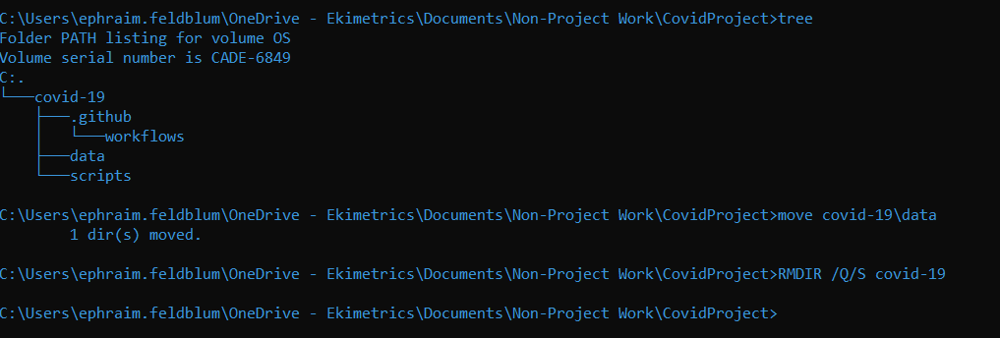
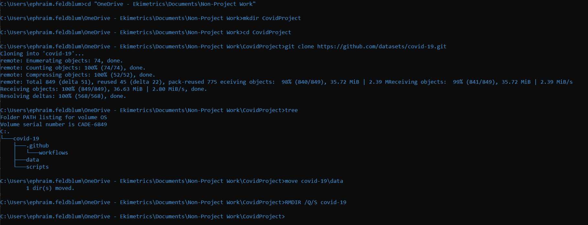

Aaron of Py-Tips fame and I have decided to offer up a little project. We're going to be taking a look at some COVID-19 data provided by Johns Hopkins and put together by Github which can be found here: https:/github.com/datasets/covid-19.

Ohhh github...well might as throw in a little git lesson here also.

Everyone spin up their cmd -

    1. Navigate to where you'd like to store these files
        For me that's `cd "OneDrive - Ekimetrics\Documents\Non-Project Work"`
    2. Make a new folder for the R file and data
        mkdir CovidProject
    3. Navigate into that file


    4. Open the github link and press the Green "Clone or Download" Button
    5. In CMD type `git clone [insert link here from last step]
    6. take a look at whats been downloaded
        Can just use `tree` here
    7. Okay so what we probably want to do is move the data out to the main folder and then delete "covid-19" folder
        `move covid-19\data` # moves the data
        `RMDIR /Q/S covid-19` # Q = quiet mode, won't ask any questions, S = all files and folders within that
    8. While you're at it:  
        Make a new folder for your outputs: `mkdir outputs`



So all together thats: ps feel free to keep the other items, it allows you to look back in time of this data.



```{r warning = FALSE, message = FALSE}
library(tidyverse)
library(purrr)
library(stringr)
library(magrittr)
library(janitor)

library(zoo)
library(modelr)

library(gghighlight)
library(scales)

library(patchwork) # arrange plots
library(gt) # make some nicer looking tables


# Ref: https://5harad.com/mse125/r/visualization_code.html
addUnits <- function(n) {
  labels <- ifelse(n < 1000, n,  # less than thousands
                   ifelse(n < 1e6, paste0(round(n/1e3), 'k'),  # in thousands
                          ifelse(n < 1e9, paste0(round(n/1e6), 'M'),  # in millions
                                 ifelse(n < 1e12, paste0(round(n/1e9), 'B'), # in billions
                                        'too big!'
                                 ))))
  return(labels)
}

 scale_y_continuous(labels = addUnits) 

Eki_theme <- theme(panel.grid.minor = element_blank(),
                   panel.grid.major = element_blank(),
                   axis.ticks = element_blank(),
                   panel.background = element_rect(fill = "transparent",colour = NA),
                   plot.background = element_rect(fill = "transparent",colour = NA))

```


# What's the point of this exercise?

I took as a chance to show off both what we have looked at so far and show off a few items coming in the next few weeks to show you how these small bits and bobs can be combined into something.

### Formatting:
I'm working on this document thinking it's somewhere between exploration and being ready to show to somebody - aka I'll put some time into making it look nice but not too much.

# Step 1: What do I have?

Okay, I've been given a folder of random data files. My plan is to try and take a peak at some of them but there first thing I need to decided is, "what is useful to me here?"

Sometimes you might know what you want to do already, but, currently, I'm flying blind - part of the beauty of R-tips.
```{r}
# checking my working directory is where I want it to be.
getwd()

list.files("data")
```


So, I'm not positive yet but I'm thinking I'll focus in on the US.

```{r}
# so I split out all the US files
fileNames <- list.files("data")
usFilesLoc <- grep("us",fileNames) # selecting the indexes of the us files
usFiles <- fileNames[usFilesLoc]
otherFiles <- fileNames[-usFilesLoc]
```

All the files are csvs which is nice.

```{r}
# Im gonna check out the "other files" first
head(read_csv(paste0("data/",otherFiles[4])),25)

otherFilesGuide <- tribble( ~file, ~contains,
         otherFiles[1],"Overall Countries with Confirmed, Recovered, and Deaths",
         otherFiles[2], "pivoted deaths for US, UK, Italy, France, Germ, Spa, Iran",
         otherFiles[3], "Countries with codes, lat&lon, population",
         otherFiles[4], "Countries with confirmed, recovered, deaths - same as 1 with province/state",
         otherFiles[5], "worldwide total confirmed, recovered, deaths, increase rate"
         )

```

I did the above manually in R and took a few moments to check out each DF. 

## US Data:

```{r}
# Because I think I'm going to focus on the US let's load all those files in

us_confirmed <- read_csv(paste0("data/", usFiles[1]))
us_deaths <- read_csv(paste0("data/", usFiles[2]))
```

```{r}
us_confirmed %>%
  head() %>%
  gt %>% 
  tab_header(
    title = md("Confirmed US Cases"),subtitle = md("&nbsp;"))

us_deaths %>%
  head()%>%
  gt %>%
  tab_header(
    title = md("Confirmed US Deaths"),subtitle = md("&nbsp;"))

```

So one of my first questions here is whether I can just merger these two dfs together? They seem pretty identical.
Some quick checks:

```{r}
ncol(us_confirmed) == ncol(us_deaths) # oo so they already don't have the same number of columns
ncol(us_confirmed) > ncol(us_deaths) # us_deaths have more

setdiff(colnames(us_deaths),colnames(us_confirmed)) #so no population in confirmed
setdiff(colnames(us_confirmed),colnames(us_deaths)) # no differences

colnames(us_deaths)

nrow(us_confirmed) == nrow(us_deaths) # same number of rows - makes sense, certain # days for certain # of places
```

Okay, I think we're pretty ready to just go ahead and rename the values column. And merge the two files.

```{r}
us_confirmed <- dplyr::rename(us_confirmed, confirmed = Case)
us_deaths <- dplyr::rename(us_deaths, deaths = Case)

us_data <- us_confirmed %>%
    full_join(us_deaths)%>%
    pivot_longer(c(deaths, confirmed), names_to = "confirm/deaths", values_to = "cumValues")%>%
    clean_names()

```
Let's do some checks on the US data - our primary source:

```{r}
library(plyr) # Im putting this here bc plyr annoys me so Im going to be unloading it at the end of this chunk 

# any missing values?

ldply(us_data,function(x)  # this function:
    sum(is.na(x)) / nrow(us_data))%>%
    dplyr::rename(Variable = `.id`, `Percent Missing` = V1)%>%
  arrange(desc(`Percent Missing`))%>%
  gt()%>%
  fmt_percent(
    columns = vars(`Percent Missing`),
    decimals =3)

detach(package:plyr, unload=TRUE)
```
so we're missing around 2% of the more granular location data

Let's take a peak at those admin areas we're missing:
```{r}
us_data %>%
    filter(is.na(admin2))%>%
    distinct(province_state)
```
Alright, every place we're missing more granular data makes sense...well let's see what areas we're covering with this data set.

```{r}
# How many areas are we counting
us_data %>% distinct(province_state) # so all the states + dc + some other US stuff (sorry Gman) + two cruise ships
us_data %>% distinct(admin2) # okay so we have 1903 localities 
```
  
Let's take a look at the amount of localities per state


```{r}
us_data %>%
    distinct(admin2, .keep_all = TRUE)%>%
    select(admin2, province_state) %$%
    table(province_state)%>%
    as.data.frame.table()%>%
    arrange(-Freq) %>%
  head(15)%>%  
  gt() %>%
  tab_header(
    title = md("Localities Per State for 15 most Divided"),subtitle = md("&nbsp;"))

```

Let's figure out what the max day, as the numbers are cumulative it will be pretty useful to save that date as a variable instead of tons of ctrl-c, ctrl-v.

```{r}
maxDate <- max(us_data$date) 
```
It's `r maxDate` and as of writing this it's the evening of April 29th so this is probably a good idea because by the time you run this code (or I rerun to send to you), the date will be different... and I made this document reactive so maybe the first part of this sentence won't even say April 28th....

Might as well also see the min date:
```{r}
min(us_data$date)
```

## Some Graphs
Alright let's maybe take a look at some graphs to try and start to get a handle on this data.

```{r message = FALSE}
us_data %>%
  filter(confirm_deaths == "confirmed")%>%
  group_by(date, province_state)%>%
  summarise(confirmed = sum(cum_values)) %>%
ggplot(aes(date,confirmed, group = province_state)) +
    geom_line(alpha = 1/3)+
    gghighlight(max(confirmed) > 40000,
            label_params = list(
                fill = NA,
                segment.color = "light blue",
                label.size = NA
            )) +
    scale_y_continuous(labels = addUnits) +
  Eki_theme +
  ggtitle("Confirmed Cases Per State")
```


Let's split NYC - as we should cuz it be the home.

```{r message = FALSE}

us_data %>%
  filter(confirm_deaths == "confirmed")%>%
  mutate(province_state = ifelse(admin2 == "New York", "NYC", province_state)) %>%
  group_by(date, province_state)%>%
  summarise(confirmed = sum(cum_values)) %>%
ggplot(aes(date,confirmed, group = province_state)) +
    geom_line(alpha = 1/3)+
    gghighlight(max(confirmed) > 40000,
            label_params = list(
                fill = NA,
                segment.color = "light blue",
                label.size = NA
            )) +
    scale_y_continuous(labels = addUnits)+
  Eki_theme +
  ggtitle("Confirmed Cases Per State & NYC")

```


Maybe we should also take a peak at what's going on inside our own state?

```{r message = FALSE}
us_data %>%
  filter(confirm_deaths == "confirmed",
         province_state == "New York")%>%
  mutate(province_state = ifelse(admin2 == "New York", "NYC", province_state)) %>%
  group_by(date, province_state,admin2)%>%
  summarise(confirmed = sum(cum_values)) %>%
ggplot(aes(date,confirmed, group = admin2)) +
    geom_line(alpha = 1/3)+
    gghighlight(max(confirmed) > 15000,
            label_params = list(
                fill = NA,
                segment.color = "light blue",
                label.size = NA
            )) +
    scale_y_continuous(labels = addUnits)+
  Eki_theme +
  ggtitle("Confirmed Cases in New York Localities")

```

## Let's zoom in on NYC

Let's get daily additions

```{r message = FALSE}
foo <- us_data %>%
  filter(admin2 ==  "New York",
         date > "2020-03-01")%>%
  group_by(confirm_deaths,admin2)%>%
  mutate(daily_vals = cum_values - lag(cum_values))

dailyConfirmed_nyc_plot <- foo %>%
  filter(confirm_deaths == "confirmed") %>%
ggplot(aes(y = daily_vals, x = date)) +
  geom_col(width = .4) + 
  Eki_theme+
  scale_y_continuous(labels = addUnits)+
  ggtitle("Daily Cases")+
  ylab("New Cases")

totalConfirmed_nyc_plot <- foo %>%
  filter(confirm_deaths == "confirmed") %>%
ggplot(aes(y = cum_values, x = date)) +
  geom_col(width = .4) + 
  Eki_theme+
  scale_y_continuous(labels = addUnits)+
  ggtitle("Total Cases")+
  ylab("Cum. Cases")

dailyConfirmed_nyc_plot + totalConfirmed_nyc_plot

```

alright, maybe let's take a look at the left chart on a 3 day rolling average:

```{r message = FALSE}
dailyConfirmed_nyc_plot_3dayavg <- foo %>%
  filter(confirm_deaths == "confirmed") %>%
 mutate(daily_vals3=rollapply(daily_vals,3,mean,fill=NA)) %>%
ggplot(aes(y = daily_vals3, x = date)) +
  geom_col(width = .4) + 
  Eki_theme+
  scale_y_continuous(labels = addUnits) +
  ggtitle("Daily Cases; 3 day Avg")+
  ylab("New Cases")

dailyConfirmed_nyc_plot_3dayavg + totalConfirmed_nyc_plot
```

And for deaths, unfortunately. 

```{r message = FALSE}
dailyDeaths_nyc_plot_3dayavg <- foo %>%
  filter(confirm_deaths == "deaths") %>%
 mutate(daily_vals3=rollapply(daily_vals,3,mean,fill=NA)) %>%
ggplot(aes(y = daily_vals3, x = date)) +
  geom_col(width = .4) + 
  Eki_theme+
  scale_y_continuous(labels = addUnits) +
  ggtitle("Daily Deaths; 3 day Avg")+
  ylab("New Cases")

totalDeaths_nyc_plot <- foo %>%
  filter(confirm_deaths == "deaths") %>%
ggplot(aes(y = cum_values, x = date)) +
  geom_col(width = .4)+
  Eki_theme+
  scale_y_continuous(labels = addUnits) +
  ggtitle("Total Deaths")+
  ylab("Cum. Cases")

dailyDeaths_nyc_plot_3dayavg + totalDeaths_nyc_plot
```


## Let's try something fun

So, yes, I understand this isn't the best "use case" for this but I don't care I'm having fun.
```{r}
us_data <- us_data %>%
  mutate(combined_key= gsub(", US","",combined_key))
```


```{r fig.width = 10}
all_locals <- us_data %>% 
filter(confirm_deaths == "confirmed") %>%

  ggplot(aes(date, cum_values, group = combined_key)) +
    geom_line(alpha = 1/3) +
  gghighlight(max(cum_values) > 20000,
            label_params = list(
                fill = NA,
                segment.color = "light blue",
                label.size = NA
            )) +
  scale_y_continuous(labels = addUnits)+
  Eki_theme +
  ggtitle("Confirmed Cases all Localities")


all_locals_subNYC <- us_data %>% 
filter(confirm_deaths == "confirmed",
       combined_key != "New York City, New York") %>%

  ggplot(aes(date, cum_values, group = combined_key)) +
    geom_line(alpha = 1/3) +
  gghighlight(max(cum_values) > 12000,
            label_params = list(
                fill = NA,
                segment.color = "light blue",
                label.size = NA,
                size =2
            ))  +
  scale_y_continuous(labels = addUnits)+
  Eki_theme +
  ggtitle("Confirmed Cases all Localities Sub NYC")


all_locals + all_locals_subNYC

```

So let's try and fit a small model for deaths based off of days and confirmed cases:

```{r}

Suffolk_data <- us_data %>%
    filter(combined_key == "Suffolk, New York",
           date >= "2020-03-01")%>%
    pivot_wider(names_from = confirm_deaths, values_from = cum_values)%>%
      group_by(combined_key)%>%
    mutate(
        daily_deaths = deaths - lag(deaths),
        daily_deaths3=rollapply(daily_deaths,3,mean,fill=0),
       
        daily_confirmed = confirmed - lag(confirmed),
        daily_confirmed3=rollapply(daily_confirmed,3,mean,fill=0))%>%
    replace_na(list(daily_deaths3 = 0, daily_confirmed3 = 0, daily_deaths =0, daily_confirmed = 0))

```

So, Let's fit a model to one of the localities and see how things look.

```{r}
suf_mod <- lm(daily_deaths3 ~ daily_confirmed3 + date, data = Suffolk_data)

```


```{r fig.height=8, fig.width= 9}
Pure_data <- Suffolk_data %>%
    ggplot(aes(date, daily_deaths3))+
    geom_line()+
    ggtitle("Suffolk Deaths")

LinTrendPlot <- Suffolk_data %>% 
  add_predictions(suf_mod) %>%
  ggplot(aes(date, pred)) + 
  geom_line() + 
  ggtitle("Linear trend + ")

residLine <- Suffolk_data %>% 
  add_residuals(suf_mod) %>% 
  ggplot(aes(date, resid)) + 
  geom_hline(yintercept = 0, colour = "grey", size = 3) + 
  geom_line() + 
  ggtitle("Remaining pattern")+
    Eki_theme

Pure_data / LinTrendPlot / residLine
```

So let's group our data into a nested dataframe so we can fit a model on every locality.

```{r}
us_step1 <- us_data %>%
    select(admin2, combined_key, date, province_state, population, 
           confirm_deaths, cum_values)%>%
    pivot_wider(names_from = confirm_deaths, values_from = cum_values)%>%     group_by(combined_key)%>%
    mutate(
        daily_deaths = deaths - lag(deaths),
        daily_deaths3=rollapply(daily_deaths,3,mean,fill=0),
       
        daily_confirmed = confirmed - lag(confirmed),
        daily_confirmed3=rollapply(daily_confirmed,3,mean,fill=0))%>%
    replace_na(list(daily_deaths3 = 0, daily_confirmed3 = 0, daily_deaths =0, daily_confirmed = 0))
    
byLocality <- us_step1 %>%
    group_by(combined_key) %>%
    nest()
    
byLocality
```

It's not very easy to look into this on an aggregate scale - but you can still peek.

```{r}
byLocality$data[[5]]
```


Alright, so now we have the data ready for this test, let's get our tools to actually perform it ready.

```{r}
local_model <- function(df) {
    lm(daily_deaths3 ~ daily_confirmed3 + date, data = df)
}
```

The dataframes are in a list so we can use purrr's map() to apply our function to each element. Purrr is kind of a scary package for me tbh.

```{r}
byLocality <- byLocality %>%
    mutate(model = map(data, local_model))

```

We did it this way to keep the results and data tied together and avoid errors.

```{r}
byLocality
```

Add residuals
```{r message = FALSE, warning=FALSE}
byLocality <- byLocality %>% 
  mutate(
    resids = map2(data, model, add_residuals)
  )
```

Unnest stem.

```{r}
resids <- unnest(byLocality, resids)
```

```{r}
resids
```


```{r}


residualPlot <- resids %>%
  ggplot(aes(date, resid)) +
    geom_line(aes(group = combined_key), alpha = 1 / 3) +
    geom_smooth(se = FALSE)+
    Eki_theme


residualPlot
```


```{r}
# build our categories - could do a join but I don't want to have to share additional data
northeast <- c("Connecticut", "Maine", "Massachusetts", "New Hampshire", "Rhode Island", "Vermont", "New Jersey", "New York", "Pennsylvania")

midwest <- c("Illinois", "Indiana", "Michigan", "Ohio", "Wisconsin", "Iowa", "Kansas", "Minnesota", "Missouri", "Nebraska", "North Dakota", "South Dakota")

south <- c("Delaware", "Florida", "Georgia", "Maryland", "North Carolina", "South Carolina", "Virginia", "District of Columbia", "West Virginia", "Alabama", "Kentucky", "Mississippi", "Tennessee", "Arkansas", "Louisiana", "Oklahoma", "Texas")

west <- c("Arizona", "Colorado", "Idaho", "Montana", "Nevada", "New Mexico", "Utah", "Wyoming", "Alaska", "California", "Hawaii", "Oregon", "Washington")

#add those regions

resids$region <- case_when(
    resids$province_state %in% northeast ~ "northeast",
    resids$province_state %in% midwest ~ "midwest",
    resids$province_state %in% south ~ "south",
    resids$province_state %in% west ~ "west",
    TRUE ~ "other"
)
```

```{r fig.width= 9}
 resids %>%
  ggplot(aes(date, resid)) +
    geom_line(aes(group = combined_key), alpha = 1 / 3) +
    geom_smooth(se = FALSE)+
    Eki_theme +
    facet_wrap(~region,
               scales = "free_y")
```

Dope, great models doing the worst in the most important area. Well if it was this easy....

```{r}
library(broom)
```
```{r}
broom::glance(suf_mod)
```


```{r}
model_deets <- byLocality %>% 
  mutate(glance = map(model, broom::glance)) %>% 
  unnest(glance)

model_deets
```
So one thing is that a lot of our models failed to run because obviously they suck (I hid this from you - but only by hiding warnings. Everything does run).

```{r}
sum(is.nan(model_deets$r.squared))/nrow(model_deets)

```
yeah so like 50+%... but a lot of it is due to some localities actually having very low variability or cases overall.


But, which of our models is the "best"


```{r}
model_deets %>%
    select(combined_key, r.squared)%>%
    arrange(desc(r.squared)) %>%
    head(50) %>%
    gt()
```
